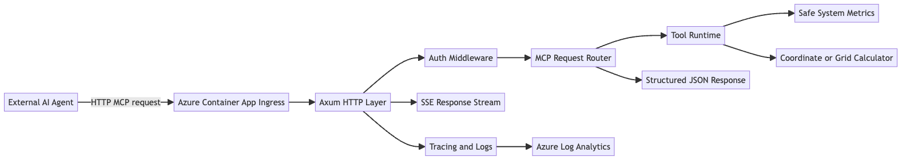
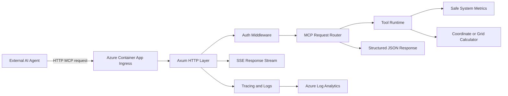

# Architecture

## High-Level Components

The initial architecture should stay intentionally small:

1. External AI agent client
2. HTTP plus SSE MCP surface
3. Lightweight Rust MCP engine
4. Azure Container App runtime
5. Azure Log Analytics-backed observability

## Component Diagram



The diagram source lives in [architecture.mmd](./architecture.mmd) and is rendered to [architecture.png](./architecture.png) with `npx @mermaid-js/mermaid-cli`. The same image is used as the gallery card preview for the awesome-azd submission.



## Implementation Direction

The Rust ecosystem around MCP is still young, so the first version should avoid a heavy framework dependency stack.

The preferred implementation path is:

- `tokio` as the async runtime
- `axum` for the HTTP layer
- standard JSON and HTTP primitives where possible
- a custom lightweight MCP engine instead of depending on a complex early-stage framework

This is not only a technical choice. It reinforces the performance and control story of the project.

## Transport Model

Because the service runs on Azure Container Apps and must be reachable by remote agents, `stdio` is not a viable primary transport.

The selected v1 transport is:

- HTTP for the public request surface
- SSE for streaming server responses where the MCP workflow requires it

## Request Flow

A typical tool request should move through the system as follows:

1. An external agent sends an HTTP MCP request.
2. The Container App receives the request through public ingress.
3. The Rust service validates a static API key carried in the `Authorization: Bearer <key>` header.
4. The MCP layer validates payload shape and tool authorization.
5. The tool runtime executes a read-only operation inside a sandboxed policy boundary.
6. The service returns structured JSON or an SSE stream response.
7. Logs and operational traces are sent to Azure Log Analytics.

## Illustrative HTTP Surface

The exact MCP route layout can still evolve, but the public surface should stay small and predictable.

An illustrative v1 shape is:

- `GET /healthz` for health checks
- `POST /mcp` for request-response style MCP calls
- `GET /mcp/events` for SSE streaming when needed

Example request:

```http
POST /mcp HTTP/1.1
Host: example.azurecontainerapps.io
Content-Type: application/json
Authorization: Bearer <api-key>

{
	"tool": "safe_system_metrics",
	"input": {
		"sections": ["cpu", "memory", "runtime"]
	}
}
```

Example response:

```json
{
	"ok": true,
	"tool": "safe_system_metrics",
	"timestamp_utc": "2026-04-26T12:00:00Z",
	"data": {
		"cpu": {
			"logical_cores": 4,
			"usage_percent": 31.2
		},
		"memory": {
			"total_mb": 8192,
			"used_mb": 2650
		},
		"runtime": {
			"sandbox_root": "/sandbox",
			"uptime_seconds": 1542
		}
	},
	"warnings": []
}
```

These examples are illustrative and should remain aligned with [Tool Contracts](./tool-contracts.md) as implementation hardens.

## Azure Deployment Shape

The first release should use a single Container App. Splitting workers or introducing extra runtime components too early adds cost and complexity without helping the initial story.

The minimum Azure footprint is:

- Resource Group
- Log Analytics Workspace
- Container Apps Environment
- Container App

`azd` should provision and wire these resources end-to-end.

## Security Model

The security posture for v1 should be strict and easy to explain:

- public ingress is enabled because external agents must reach the service over HTTP
- a static API key in the `Authorization` header with the `Bearer` scheme gates access in the first release
- high-risk operations such as write, delete, install, or unrestricted shell execution are disallowed
- only approved read-only commands are allowed when shell-backed tools exist
- command execution is confined to a defined sandbox boundary

## Signature Tools

The first tools should support the project's story instead of looking like generic sampleware.

Recommended v1 tools:

- Safe System Metrics: read-only CPU, memory, disk, and container/runtime inspection
- Coordinate or Grid Calculator: a deterministic spatial utility that reflects domain depth beyond toy examples

## Design Principles

Architecture decisions should continue to follow these principles:

- least privilege by default
- deterministic behavior for every tool path
- small runtime surface and minimal dependencies
- observability from day one
- deployability shaped around `azd` template expectations

## Next Documentation Layer

The next architecture iteration should add:

- a component diagram
- concrete MCP endpoint shapes and transport examples
- a production-grade secret rotation story beyond a static API key
- middleware composition and request tracing flow

Detailed drafts for tool payloads and Azure runtime shape now live in:

- [Tool Contracts](./tool-contracts.md)
- [Deployment](./deployment.md)